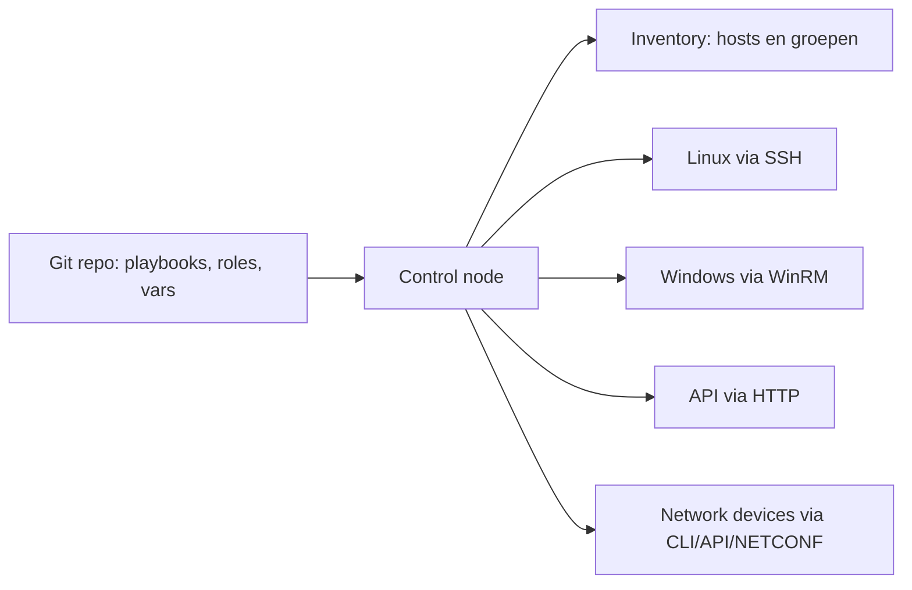

# 01 - IaC basisbegrippen

## Kernzin voor het mondeling

**Infrastructure as Code betekent dat je infrastructuur beschrijft, beheert en uitrolt via machineleesbare bestanden, zodat infrastructuur herhaalbaar, controleerbaar en versieerbaar wordt zoals software.**

## Wat is IaC?

Infrastructure as Code, afgekort **IaC**, is het idee dat je infrastructuur niet meer vooral via klikwerk beheert, maar via code of configuratiebestanden. Denk aan servers, netwerken, packages, users, firewallregels, cloud resources, Windows-configuratie, Linux-configuratie en soms zelfs netwerkapparaten.

Het belangrijkste is niet dat er “code” bestaat. Het belangrijkste is dat die code de **bron van waarheid** wordt. Als iemand wil weten hoe een server hoort te zijn, kijkt die persoon niet naar een screenshot of naar wat ooit manueel geklikt werd, maar naar de repository.

## Waarom is dit belangrijk?

Manuele configuratie voelt snel aan, maar wordt gevaarlijk wanneer je het moet herhalen. Eén server met de hand configureren lukt. Tien servers exact hetzelfde houden is al moeilijker. Na enkele weken weet niemand nog exact wat er veranderd is.

IaC lost vooral deze problemen op:

| Probleem zonder IaC | Oplossing met IaC |
|---|---|
| Manuele fouten | Taken worden herhaalbaar uitgevoerd |
| Onduidelijke wijzigingen | Git toont wie wat wanneer veranderde |
| Verschillen tussen machines | Dezelfde gewenste toestand wordt opnieuw toegepast |
| Moeilijk rollbacken | Je kan terug naar een vorige versie van de repo |
| Geen bewijs | Je hebt code, output, logs en checks |

## Desired state versus current state

Een IaC-tool werkt vaak met twee toestanden:

- **Desired state**: hoe de infrastructuur volgens jouw code moet zijn.
- **Current state**: hoe de infrastructuur op dit moment echt is.

De tool probeert het verschil tussen die twee te verkleinen.

Voorbeeld: je zegt in Ansible dat `nginx` geïnstalleerd moet zijn. Als nginx al geïnstalleerd is, verandert Ansible niets. Als nginx ontbreekt, installeert Ansible het.

```yaml
- name: Installeer nginx
  ansible.builtin.package:
    name: nginx # package die aanwezig moet zijn
    state: present # gewenste toestand: geïnstalleerd
```

## IaC is meer dan een script

Een script kan automatiseren, maar een script is niet automatisch goede IaC. Een random bash-script kan hardcoded IP-adressen, dubbele logica en onduidelijke foutafhandeling bevatten. IaC vraagt structuur.

Een slecht script zegt eigenlijk: “voer deze commando's uit en we hopen dat het werkt.”

Goede IaC zegt: “dit is de gewenste toestand, dit is de inventory, dit zijn de variabelen, dit is reproduceerbaar, en dit kan gecontroleerd worden.”

```bash
./install.sh # voert een script uit, maar zegt niet automatisch of het idempotent of veilig is
```

```bash
ansible-playbook -i inventories/lab/hosts.yml playbooks/site.yml # voert een playbook uit tegen een duidelijke inventory
```

## Toollandschap

IaC is geen enkel product. Het is een manier van werken met verschillende toolcategorieën.

| Tooltype | Voorbeelden | Sterk in |
|---|---|---|
| Provisioning | Terraform, OpenTofu, cloud-native templates | Resources aanmaken: VM's, netwerken, cloudservices |
| Configuration management | Ansible, Puppet, Chef, Salt | OS en applicaties configureren |
| Orchestration | Ansible, AWX, pipelines | Meerdere stappen gecoördineerd uitvoeren |
| Policy/compliance | OPA, checks, linting | Controleren of regels gevolgd worden |

## Ansible in één beeld



Ansible draait meestal vanaf een **control node**. Die leest je project, inventory en variabelen. Daarna voert Ansible modules uit op managed nodes of tegen API's.

## Belangrijke begrippen

### Idempotentie

Idempotentie betekent: je mag dezelfde actie meerdere keren uitvoeren en na de eerste keer verandert er niets meer zolang de input hetzelfde blijft.

Een goede mondelinge zin:

> Idempotentie is essentieel omdat een tweede run moet aantonen dat mijn infrastructuur stabiel is. Run 1 brengt de omgeving naar de gewenste toestand, run 2 toont normaal vooral `ok` en weinig of geen `changed`.

### Declaratief versus imperatief

- **Declaratief**: je beschrijft wat het eindresultaat moet zijn.
- **Imperatief**: je beschrijft stap voor stap wat er moet gebeuren.

Ansible zit wat tussen beide. Een playbook bestaat uit taken, maar modules zoals `package`, `service`, `user` en `file` werken duidelijk met gewenste toestanden.

```yaml
- name: Zorg dat de service draait
  ansible.builtin.service:
    name: nginx # naam van de service
    state: started # gewenste toestand: actief
    enabled: true # start automatisch bij boot
```

## Typische examenvraag

**Vraag:** Waarom is IaC beter dan manueel klikken?

**Sterk antwoord:**

IaC is beter dan manueel klikken omdat de infrastructuur reproduceerbaar, traceerbaar en testbaar wordt. Bij manuele configuratie weet je later vaak niet meer exact welke stappen uitgevoerd zijn. Met IaC staat de gewenste toestand in Git. Daardoor kan je wijzigingen reviewen, opnieuw uitvoeren, automatiseren en bewijzen met output. Het vermindert menselijke fouten en maakt beheer schaalbaarder.

## Mini-checklist

- Kan je IaC definiëren zonder alleen “automatisering” te zeggen?
- Kan je uitleggen waarom een script niet automatisch IaC is?
- Kan je desired state en current state uitleggen?
- Kan je idempotentie uitleggen met run 1 en run 2?
- Kan je zeggen waar Ansible sterk in is tegenover Terraform/OpenTofu?
