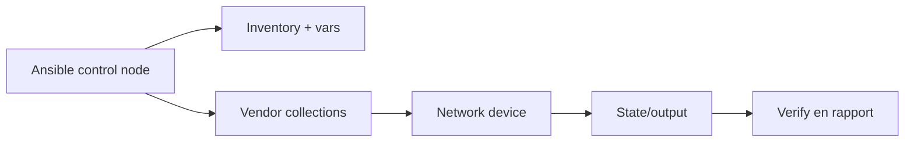
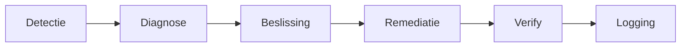

# 11 - Network automation en self-healing

## Kernzin voor het mondeling

**Network automation beheert netwerkconfiguratie via code, maar vraagt extra voorzichtigheid omdat fouten meteen bereikbaarheid, monitoring en meerdere systemen kunnen beïnvloeden.**

## Waarom netwerkautomation anders is

Een serverconfiguratie wijzigen raakt meestal één machine. Een netwerkconfiguratie wijzigen kan veel machines raken. Als je een verkeerde VLAN, route, ACL of interfaceconfiguratie pusht, kan je jezelf buitensluiten.

Daarom is de basisworkflow belangrijk:

1. Inventory controleren.
2. Verbinding testen.
3. Current state ophalen.
4. Backup maken.
5. Desired state toepassen.
6. Verify uitvoeren.
7. Rapporteren.
8. Drift gericht corrigeren.

## Architectuur



## Inventoryvoorbeeld

```yaml
all:
  children:
    switches:
      hosts:
        sw01:
          ansible_host: 10.0.0.11 # management-IP van switch
          ansible_network_os: cisco.ios.ios # netwerkplatform/collection
          ansible_connection: ansible.netcommon.network_cli # connectie via netwerk-CLI
```

## Collections

```yaml
collections:
  - name: cisco.ios # modules voor Cisco IOS
  - name: ansible.netcommon # algemene netwerkconnectie en utilities
```

Installeren:

```bash
ansible-galaxy collection install -r requirements.yml # installeert netwerkcollections uit requirements.yml
```

## Eerst connectiviteit testen

```bash
ansible switches -i inventories/network/hosts.yml -m cisco.ios.ios_facts # haalt facts op van netwerkapparaten
```

## Backup vóór wijziging

```yaml
- name: Maak backup van running config
  cisco.ios.ios_config:
    backup: true # bewaart huidige configuratie als backup
  register: backup_result # bewaart pad/metadata van backup
```

## Van commando naar desired state

Losse commando's kunnen nodig zijn, maar resource modules zijn vaak beter omdat ze met gewenste toestand werken.

```yaml
- name: Configureer VLAN's declaratief
  cisco.ios.ios_vlans:
    config:
      - name: users # VLAN-naam
        vlan_id: 10 # VLAN-id
        state: active # VLAN moet actief zijn
      - name: servers # VLAN-naam
        vlan_id: 20 # VLAN-id
        state: active # VLAN moet actief zijn
    state: merged # voeg toe/merge zonder alles te vervangen
```

## Verify

Verify is bewijs dat de gewenste state echt klopt.

```yaml
- name: Haal VLAN-status op
  cisco.ios.ios_command:
    commands:
      - show vlan brief # toont VLAN-overzicht
  register: vlan_output # bewaart commandoutput
  changed_when: false # verify verandert niets

- name: Controleer of VLAN 10 bestaat
  ansible.builtin.assert:
    that:
      - "'10' in vlan_output.stdout[0]" # verwacht VLAN 10 in output
    fail_msg: "VLAN 10 ontbreekt" # duidelijke foutmelding
```

## Compliance en drift

- **Compliance**: de actuele toestand voldoet aan de gewenste regels.
- **Drift**: actuele toestand wijkt af van de gewenste toestand.

Drift kan ontstaan door manuele hotfixes, noodwijzigingen, vendor defaults of verouderde configuratie.

## Self-healing network

Een self-healing network detecteert problemen, analyseert ze, beslist of herstel veilig is, voert remediatie uit, verifieert het resultaat en logt wat gebeurd is.

Belangrijk: self-healing is geen magie. Je moet fail-toestanden definiëren.



## Fail-toestand voorbeeld

Een interface flap is niet altijd reden tot automatisch herstel. Misschien was het een korte hapering. Daarom bouw je guardrails:

- Hoe vaak gebeurt het?
- Hoelang duurt het?
- Welke impact heeft het?
- Is automatisch herstel veilig?
- Is menselijk akkoord nodig?

## Typische examenvraag

**Vraag:** Waarom moet network automation voorzichtiger zijn dan gewone server automation?

**Sterk antwoord:**

Omdat netwerkconfiguratie de bereikbaarheid van veel systemen tegelijk kan beïnvloeden, inclusief je eigen toegang en monitoring. Daarom moet je vóór wijzigingen connectiviteit testen en backups maken, daarna desired state toepassen en altijd verify uitvoeren. Bij self-healing moet je bovendien duidelijke fail-toestanden en guardrails definiëren, zodat automation niet blind schade veroorzaakt.

