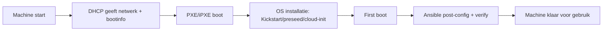

# 13 - PXE, bare metal en examen

## Kernzin voor het mondeling

**PXE is een vroege netwerkbootfase; volledige provisioning vraagt ook OS-installatie, identiteit, netwerk, credentials, applicaties, post-configuratie en validatie.**

## PXE is niet hetzelfde als volledige provisioning

PXE helpt een machine via het netwerk booten. Maar daarna moet nog veel gebeuren:

- DHCP geeft netwerkinfo en bootinformatie.
- TFTP/iPXE levert bootloader of bootscript.
- Kickstart/preseed/cloud-init automatiseert installatie of initiële configuratie.
- Ansible doet post-configuratie, validatie en orkestratie.

Een machine is pas klaar als ze veilig, bereikbaar en correct geconfigureerd is.

## Bare metal provisioning in flow



## Magnum Opus beoordeling

De puntenverdeling uit de theorie:

- Permanente evaluatie: 30%.
- Magnum Opus/projectopdracht: 40%.
- Mondelinge kennis- en inzichtstoets: 30%.

Tweede examenkans:

- Projectopdracht: 40%.
- Mondelinge toets: 30%.
- Permanente evaluatie is niet herhaalbaar.

## Wat moet je indienen?

- URL van private GitHub-repository.
- Submit-tag: `submission-v1`.
- Projectdocumentatie als PDF volgens AP-sjabloon.
- Extra bewijsbestanden alleen als ze niet al duidelijk in repo/PDF staan.

Git-afspraken:

```bash
git status # controleert of je working tree clean is
git tag submission-v1 # maakt submit-tag op huidige commit
git push origin main # pusht finale code naar GitHub
git push origin submission-v1 # pusht submit-tag naar GitHub
```

## README versus PDF

README:

- hoe voer je het project uit?
- welke dependencies zijn nodig?
- welke inventory gebruik je?
- hoe gebruik je Vault?
- hoe controleer je dat het werkt?

Project-PDF:

- waarom maakte je bepaalde keuzes?
- welke bewijsstukken toon je?
- hoe onderbouw je security?
- welke bronnen gebruikte je?
- welke beperkingen zijn er?

## Examenverloop

Bij start tijdslot:

1. Aanmelden.
2. Laptop op aangeduide plaats.
3. Magnum Opus-repo openen.
4. Tonen dat je op finale versie zit.
5. Projectrun starten.
6. Drie theorievragen trekken.
7. Schriftelijk voorbereiden.
8. Mondeling bespreken.

Niet toegestaan tijdens examenmoment: AI-tools, chat of andere niet-toegestane hulp.

## Als de run faalt

Raak niet in paniek. Leg professioneel uit:

- wat je verwachtte;
- waar het faalt;
- welke output dat toont;
- of het een inputprobleem, connectivityprobleem, dependencyprobleem of codeprobleem is;
- wat je normaal zou doen om het te onderzoeken.

## Typische examenvraag

**Vraag:** Waarom is PXE geen volledige provisioning?

**Sterk antwoord:**

PXE is vooral de netwerkbootfase. Het zorgt dat een machine via netwerk kan starten en installatie-informatie kan krijgen. Maar provisioning omvat veel meer: OS-installatie, identiteit, netwerkconfiguratie, credentials, applicaties, security en post-configuratie. Ansible past vooral goed in die post-configuratie, validatie en orkestratie.

