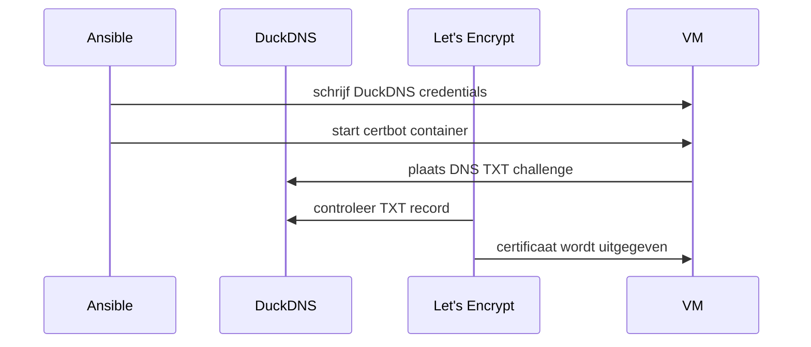

# Architectuur en datastroom

## Hoofdidee

Je project heeft twee kanten:

1. **Control node**: de computer waar je Ansible uitvoert.
2. **Target node**: de Rocky/Alma Linux VM waarop Vaultwarden komt te draaien.

Ansible maakt via SSH verbinding met de target node en voert daar taken uit met `become: true`, dus met sudo-rechten.

```text
Control node
  |
  | ansible-playbook via SSH
  v
Target VM: rocky1 / 172.16.120.11
```

## Netwerkpad van een gebruiker

Wanneer iemand Vaultwarden opent, loopt het verkeer zo:

```text
Browser
  |
  | HTTPS naar vaultwarden-magnumopus.duckdns.org
  v
Nginx op poort 443
  |
  | proxy_pass naar 127.0.0.1:8080
  v
Vaultwarden container
```

Belangrijk: Vaultwarden zelf luistert niet publiek op het netwerk. De container is gebonden op:

```text
127.0.0.1:8080
```

Dat betekent dat alleen de lokale machine erbij kan. Externe gebruikers gaan altijd via Nginx.

## Waarom Nginx ertussen?

Nginx doet drie belangrijke dingen:

| Functie | Uitleg |
|---|---|
| HTTPS beëindigen | Nginx gebruikt het Let's Encrypt certificaat |
| Reverse proxy | Nginx stuurt verkeer door naar Vaultwarden lokaal |
| Security headers | Nginx voegt headers toe zoals HSTS en X-Frame-Options |

## Waarom DNS-01 challenge?

Normaal gebruikt Let's Encrypt vaak HTTP-01. Daarbij moet Let's Encrypt via internet naar jouw server kunnen op poort 80. In jouw project draait de VM in een VMware/labomgeving en heeft die geen publiek IP.

Daarom gebruik je **DNS-01**:



Bij DNS-01 controleert Let's Encrypt niet of je server publiek bereikbaar is. Het controleert of je een DNS-record kunt aanpassen. Omdat jij het DuckDNS token hebt, kun je bewijzen dat je controle hebt over het domein.

## Firewallmodel

Je firewall laat enkel dit toe:

```yaml
firewall_allowed_services:
  - ssh   # nodig zodat Ansible via SSH kan verbinden
  - http  # nodig voor HTTP redirect naar HTTPS
  - https # nodig voor veilige toegang via Nginx
```

Alles wat niet nodig is, blijft dicht. Dat is een security baseline.

## SELinux in je project

Op Rocky/Alma Linux kan SELinux actief zijn. Standaard mag Nginx niet zomaar netwerkverbindingen maken naar backends. Omdat Nginx moet proxyen naar Vaultwarden op `127.0.0.1:8080`, zet je deze boolean:

```bash
setsebool -P httpd_can_network_connect on # laat Nginx/httpd netwerkverbindingen maken naar een backend
```

In Ansible doe je dit via:

```yaml
- name: Allow Nginx to proxy to local Vaultwarden under SELinux # taaknaam voor duidelijkheid
  ansible.posix.seboolean: # Ansible module om SELinux booleans te beheren
    name: httpd_can_network_connect # boolean die Nginx proxyverkeer toestaat
    state: true # zet de boolean aan
    persistent: true # blijft actief na reboot
```

## Persistente data

Vaultwarden draait in een container, maar data moet blijven bestaan als de container opnieuw start. Daarom mount je een hostdirectory:

```text
/opt/vaultwarden/data -> /data in de container
```

In Quadlet staat dat zo:

```ini
Volume=/opt/vaultwarden/data:/data:Z # hostdata blijft persistent en :Z geeft correcte SELinux context
```

## Waarom systemd?

Containers kunnen stoppen na reboot als ze niet als service beheerd worden. Met Podman Quadlet maak je een `.container` file. Systemd zet die om naar een service.

Daarna kun je Vaultwarden beheren met:

```bash
systemctl status vaultwarden.service # toont of de Vaultwarden container-service actief is
systemctl restart vaultwarden.service # herstart de Vaultwarden container-service
systemctl enable vaultwarden.service # zorgt dat Vaultwarden automatisch start bij boot
```

## Kernzin voor mondeling

> De architectuur bestaat uit een Ansible control node die via SSH een Rocky/Alma VM configureert. Op de VM draait Vaultwarden als Podman container, beheerd door systemd via Quadlet. Nginx staat ervoor als HTTPS reverse proxy en TLS wordt geregeld met Let's Encrypt via DuckDNS DNS-01. De firewall laat alleen ssh, http en https toe en SELinux wordt correct ingesteld zodat Nginx lokaal mag proxyen.
