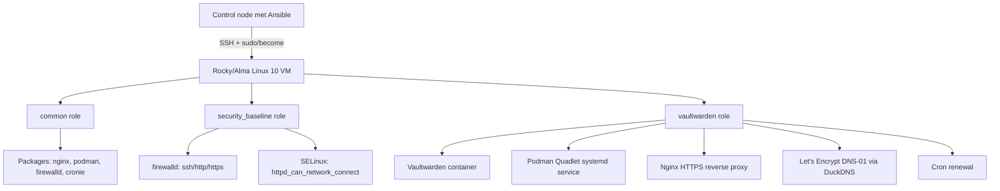

# Magnum Opus — Vaultwarden deployment

!!! abstract "Kernzin voor je mondeling"

    Mijn Magnum Opus automatiseert de deployment van **Vaultwarden** op een Rocky/Alma Linux 10 VM met **Ansible**. Het project installeert de basispackages, zet beveiliging klaar, deployt Vaultwarden als **Podman Quadlet systemd-service**, plaatst **Nginx** als reverse proxy, vraagt een **Let's Encrypt certificaat** aan via **DuckDNS DNS-01**, beheert secrets via **Ansible Vault** en bewijst daarna **idempotentie** met twee geslaagde runs.

## Wat deployt je project?

| Onderdeel | Wat doet het? | Waarom belangrijk? |
|---|---|---|
| Vaultwarden | Password manager compatibel met Bitwarden | Duidelijke echte applicatie, niet enkel een demo |
| Podman | Draait Vaultwarden als container | Container-runtime zonder Docker daemon |
| Quadlet | Maakt van de container een systemd-service | De container start automatisch en is beheerbaar via `systemctl` |
| Nginx | Reverse proxy naar Vaultwarden | Eén nette HTTPS-ingang voor de gebruiker |
| Let's Encrypt | TLS-certificaat | Beveiligde HTTPS-verbinding |
| DuckDNS DNS-01 | Certificaat zonder publiek IP | Ideaal voor VMware/labomgeving |
| firewalld | Alleen noodzakelijke services open | Security baseline |
| SELinux boolean | Laat Nginx lokaal proxyen | Nodig op RedHat-family systemen |
| Ansible Vault | Verbergt admin token en DuckDNS token | Geen secrets in Git |
| Evidence | Runlogs en checks | Bewijs dat het werkt en idempotent is |

## Architectuur in één beeld

## Wat moet je zeker kunnen uitleggen?

1. **Waarom Ansible?** Omdat je een server reproduceerbaar en idempotent configureert met code.
2. **Waarom roles?** Omdat je project logisch is opgesplitst: basis, security en applicatie.
3. **Waarom Podman Quadlet?** Omdat je container netjes beheerd wordt door systemd.
4. **Waarom DNS-01?** Omdat je VM geen publiek IP nodig heeft voor certificaatvalidatie.
5. **Waarom Ansible Vault?** Omdat tokens en admin secrets niet plaintext in Git mogen staan.
6. **Waarom run 2 belangrijk is?** Omdat die bewijst dat je playbook idempotent is.

## Mondeling antwoord in 30 seconden

> Ik heb een Vaultwarden password manager volledig automatisch gedeployed met Ansible. Mijn playbook draait op de groep `vaultwarden` en gebruikt drie roles: `common`, `security_baseline` en `vaultwarden`. De common role installeert basispackages zoals Podman, Nginx, firewalld en cronie. De security role beperkt de firewall en zet SELinux correct. De vaultwarden role maakt directories, templates, een Podman Quadlet unit, vraagt via DuckDNS DNS-01 een Let's Encrypt certificaat aan en configureert Nginx als HTTPS reverse proxy. Secrets zoals het admin token en DuckDNS token staan in Ansible Vault. Ik heb ook bewijsstukken voorzien, waaronder twee runs waarbij run 2 `changed=0` toont, wat idempotentie bewijst.

## Waarom dit project sterk is

!!! success "Sterke punten"

    - Je gebruikt echte IaC-principes: declaratief, reproduceerbaar en idempotent.
    - Je hebt duidelijke roles en variabelen.
    - Je gebruikt secrets veilig via Vault.
    - Je lost een realistisch TLS-probleem op met DNS-01.
    - Je levert bewijsstukken, niet alleen code.
    - Je project is verdedigbaar: elke keuze heeft een reden.

## Wat is bewust niet gedaan?

| Niet gedaan | Waarom niet? |
|---|---|
| PostgreSQL/MariaDB | SQLite is voldoende voor kleine lab/persoonlijke setup |
| SMTP | Niet nodig voor de kern van de opdracht |
| High availability | Te groot voor deze opdracht |
| Monitoring stack | Interessant, maar buiten scope |
| LDAP/SSO | Enterprise-functionaliteit, niet nodig voor basisdeployment |

!!! tip "Gebruik deze zin als de docent vraagt waarom je scope beperkt is"

    Ik heb bewust gekozen voor een sterke, werkende en reproduceerbare basisdeployment in plaats van veel extra features die de scope groter maken maar niet noodzakelijk meer IaC-kwaliteit bewijzen.
